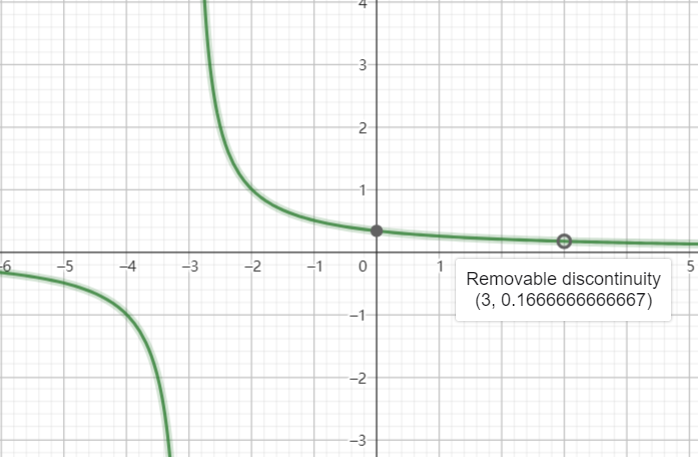

public:: true

- [【官方双语/合集】微积分的本质 - 系列合集-哔哩哔哩](https://b23.tv/BHF6p1X) 有 "[[牛顿二项式定理]]" 和高一 "[[函数]], [[幂函数]], [[指数函数]], [[对数函数]], [[三角函数]]" 的知识后看着会轻松些
	- 牛顿二项式定理就是展开 $(a-b)^n$ 的方法, 可以自己慢慢推推看, 总结规律
	- 高一知识可以在[网课](https://basic.smartedu.cn/syncClassroom?defaultTag=e7bbcefe-0590-11ed-9c79-92fc3b3249d5%2Fe7bbcf80-0590-11ed-9c79-92fc3b3249d5%2F5036342963%2F5036342972)看, 大约二分之一到三分之二学期的内容(不用精通到能做全部习题的程度, 了解一下就行).
- [做题网站](https://brilliant.org/3b1b)
- [[怎样解题]] 书
- [求导 100 题](https://zhuanlan.zhihu.com/p/669755353?utm_psn=1867246627699425280) 看完第六集后可以开始做
- [导数计算器](https://mathdf.com/der/cn/) 有步骤, 可以知道自己错在哪 x' 等价 dx
- [toc]
-
- ## 第一集 简介
	- 圆的面积
		- 将圆切分成许多厚度一致的同心圆, 他们的厚度非常小(趋于 0)称为dx.
		- 将同心圆断开拉直近似成一长方形, 它的面积是 $dx*2 \pi R$ (大小写 rR 都是[[半径]], [[直径]]是d(北京教材坑人, 一直以为大 R 是直径))
		- 将所有长方条竖过来, 由短到长从左向右排列, 当dx 越来越小的时候, 形状越来越近似为一三角形. 三角形的底为 dx 之和为 R, 三角形的高为 $2 \pi R$, 面积为 $\frac{R * 2 \pi R}{2} = \pi R^2$
	- 函数 $x^2$ 的[[积分]] A(x)
	  id:: 6789d497-d29b-4628-b259-119d16d38aae
		- 在抛物线 $x^2$ 中 0 到 × 部分的面积记成函数 A(x). A(x) 是 $x^2$ 的积分 (抛物线和x轴围成的图形的面积)
		- 从点 x 向右一点 (dx) 围成一小块面积称为 dA, 其近似面积为 $dx * x^2$ 的小长方形. $\frac{dA}{dx} \approx x^2$.
		- $\frac{A(x + dx) - A(x)}{dx} \approx x^2$
			- 类似于: $\frac{A(3.00001) - A(3)}{0.00001} \approx x^2$
			- $\frac{dA}{dx}$ 在 dx 趋于无穷小时趋向的值 ($x^2$)称为 A 的[[导数]]
- ## 第二集 导数
	- [[导数]]不是瞬时变化率, 是某一点的变化率的最佳近似
	  id:: 678cdc01-ce9d-42e8-9078-8a11e06fe249
	- 根据测量车子运行的距离与时间, 可以画出距离关于时间的函数
	- 每一段时间运行的速度不同, 可以画出速度关于时间的函数
	- 速度(v)和路程(S)都是关于时间(t), 他们两者也有关联
	- 将 dt 看作时间 t 的微小变化量
	- 路程的变化除以时间的变化就是这一段的平均速度
		- 设路程 S 关于时间 t 变化的函数是  $S(t) = t^{3}$
			- $$\begin{aligned}
			  \frac{S(t + dt) - S(t)}{dt} &= \frac{(t + dt)^{3} - t^{3}}{dt} \\
			  &= \frac{t^{3} + 3t^{2}dt + 3t(dt)^{2} + dt^{3} - t^{3}}{dt} \\
			  &= \frac{dt(3t^{2} + 3tdt + dt^{2})}{dt} \\
			  &= 3t^{2} + 3tdt + dt^{2} \\
			  dt &\to 0 \\
			  &= 3t^{2}
			  \end{aligned}$$
	- dt 趋于 0 时, 路程关于时间的导函数是 $3t^2$
	- $3t^2$ 指的是路程关于时间函数上某一点 t 的斜率, 也是该点的变化率的最佳近似
- ## 第三集 用[[几何]][[求导]]
	- 用图像的方法理解导数, 即 y 的微小变化量 比 x 的微小变化量
	- $y = f(x) = x^2$
		- 想象一个正方形, 他的边长为 x, 面积为 f(x).
		- 他的边长的微小变化量为 dx, 面积的微小变化量为 df(x)
		- 变长 x 增长 dx 多出来的面积等于 2份长条状的 (边长x 乘以 边长的微小变化量dx) 加上 1份 (边长的微小变化量的平方)
			- 即
			- $$\begin{aligned}
			  df(x) &= 2x * dx + (dx)^2 \\
			  \frac{df(x)}{dx} &= 2x + dx
			  \end{aligned}$$
			- 或
			- $$\begin{aligned}
			  \frac{df(x)}{dx} &= \frac{2x*dx + (dx)^2}{dx} \\
			  \frac{df(x)}{dx} &= 2x + dx
			  \end{aligned}$$
			- 将 dx 趋于 0, 得到
			- $$\frac{df(x)}{dx} = 2x$$
			- 即 $f(x)=x^2$ 的导数是 2x
	- $f(x)=x^3$
		- 想象成正方体, 并用 dx 趋于 0 来消掉棱和角, 剩下 3 个面
	- 总结: [[幂函数]] $x^n$ 的[[导数]]是: $nx^{n-1}$
		- $\frac{(x+dx)^n-x^n}{dx}$
			- $x^n$ 会和 $-x^n$ 消去
			- $x^{n-a}(dx)^{a}$, a>1 的项会因无法消干净 dx, 在 dx -> 0 时消去
			- 剩下 n 个 $x^{n-1}dx$, dx 与分母约分后剩下 $nx^{n-1}$
	- $f(x) = \frac{1}{x}$
		- 可以用[[幂函数]]的求导公式求导
		- 也可以用[[几何]]考虑
			- 想象一个面积为 1 (函数内的常数项分子), 边长分别为 f(x), x 的矩形.
			- x 的增减所引发的图像右侧面积的变化, 会引发图像上方面积相等, 但符号相反的变化 (因为面积固定为 1)
			- 所以有
				- $$\begin{aligned}
				  x * (-df(x)) &= f(x) * dx \\
				  \frac{df(x)}{dx} &= -\frac{1}{x^2}
				  \end{aligned}$$
	- [[三角函数]] $sin(\theta)$ 的[[导数]]是 $cos(\theta)$
		- $cos(\theta)$ 的导数是 $-sin(\theta)$
		- 想象在单位圆上弧长增长 $d\theta$ 并因其起点和终点画出一新的极小直角三角形.
		- 弧长的增长因为极小被视为三角形的斜边.
		- 此三角形与原大三角形相似.
			- 利用切线与半径的垂直关系证明
		- 因此小三角形的 dy 比 斜边 正好等于大三角形的 x 比 斜边, 即 $cos(\theta)$
		- 或者通过三角函数图像的变化率近似画出其导数图像
	- [[求导]]公式
	  id:: 679799b5-ee31-4fd0-a11f-95730e359769
		- $$\frac{d(f(x))}{dx}=\frac{f(x+dx) - f(x)}{dx}$$
		- 用 $f(x)=x^2$ 举例
			- $$\begin{aligned}
			  \frac{d(f(x))}{dx} &=\frac{f(x+dx) - f(x)}{dx} \\
			  &=\frac{(x+dx)^2 - x^2}{dx} \\
			  &= \frac{x^2+2xdx+(dx)^2 - x^2}{dx} \\
			  &= \frac{dx(2x + dx)}{dx} \\
			  &= 2x + dx \\
			  dx &\to 0 \\
			  &= 2x
			  \end{aligned}$$
	- [[什么是数学]]中[[求导]]是从 x + dx 和 x - dx 两个方向逼近 x 的, 公式是:
	  id:: 679799b5-c9a2-44b2-8abc-ca1a1fcfe05a
		- $$\frac{d(f(x))}{dx}=\frac{f(x+dx) - f(x-dx)}{x+dx-(x-dx)}$$
		- 用 $f(x)=x^2$ 举例
			- $$\begin{aligned}
			  \frac{d(f(x))}{dx} &=\frac{f(x+dx) - f(x-dx)}{x+dx-(x-dx)} \\
			  &=\frac{(x+dx)^2 - (x-dx)^2}{2dx} \\
			  &= \frac{x^2+2xdx+(dx)^2 - (x^2-2xdx+(dx)^2)}{2dx} \\
			  &= \frac{4xdx}{2dx} \\
			  &= 2x
			  \end{aligned}$$
			- 没有 $dx \to 0$ 的步骤
- ## 第四集 导数的加法, 乘法与链式法则
	- [[导数]]的加法法则
		- $f(x) = sin(x)+x^2$
			- y 轴的微小变化量 df 等于两个函数各自的微小变化量 (d(sin(x) 与 d(x^2)) 的和
			- y 轴的微小变化量的和 df 除以 x 轴的微小变化量 dx 等于导数
			- 两个函数各自的 y 轴的微小变化量等于其导数 (cos(x)和2x) 与 x 轴的微小变化量 dx 的积
			- $$\begin{aligned}
			  df &= d(sin(x) + x^2) \\
			  &= dsin(x) + d(x^2) \\
			  &= cos(x)dx + 2xdx \\
			  \frac{df}{dx}&=cos(x) + 2x
			  \end{aligned}$$
			- 或
			- $$\begin{aligned}
			  \frac{df}{dx} &= \frac{d(sin(x) + x^2)}{dx} \\
			  &= \frac{dsin(x) + d(x^2)}{dx} \\
			  &= \frac{cos(x)dx + 2xdx}{dx} \\
			  &=cos(x) + 2x
			  \end{aligned}$$
		- d(f(x)) = d(a(x)+b(x)) = d(a(x)) + d(b(x))
	- [[导数]]的乘法法则
		- $f(x) = sin(x)x^2$
			- 想象为一矩形, 两边的长分别为 sin(x) 和 $x^2$
			- sin(x) 和 $x^2$ 的微小变化 dsin(x) 和 $d(x^2)$ 会导致面积的微小变化 df, 现仅(简单)考虑面积增长
			- $df = sin(x)d(x^2)+x^2d(sin(x))+d(sin(x))d(x^2)$
				- 最后一项会出现 $(dx)^2$, 太小, 舍去
			- $df = sin(x)2xdx + x^2cos(x)dx$
			- $\frac{df}{dx} = sin(x)2x + x^2cos(x)$
		- [[什么是数学]]中没有提, 但是依据其从自变量取值的左侧和右侧同时逼近点 x 的思想以及[[微积分的本质]]中的画图思想综合可以得出以下内容:
			- 想象为一矩形, 两边的长分别为 sin(x) = m 和 $x^2 = n$
			- m 和 n 的微小变化 dm, dn 会导致面积的微小变化 df, **现同时考虑增长和减小**
			- 当 x 改变了 **+dx** 时. 思考矩形图像, 其中一边的面积增长量为 m*dn, 另一边的面积增长量为 n*dm, 再加上一个没算到的小矩形 dmdn, 合起来就是面积 f(x) 的变化量
				- f(x) 的变化量为 $sin(x)d(x^2)+x^2d(sin(x))+d(sin(x))d(x^2)$ 设其为 a + b + c. 在矩形图形上表示为两个细长的矩形加上一个小矩形
			- 当 x 改变了 **-dx** 时. 思考矩形图像, 其中一边的面积减少量为 m*dn, 另一边的面积减少量为 n*dm, 再减去一个重复算了 2 次的小矩形 dmdn, 合起来就是面积 f(x) 的变化量
				- f(x) 的变化量为为 a + b - c. 即: $sin(x)d(x^2)+x^2d(sin(x))-d(sin(x))d(x^2)$. 在矩形图形上表示为两个细长的矩形减去它们重叠的小矩形
			- 从 **x-dx 到 x+dx**, f(x) 的总变化量为 (a+b+c)+(a+b-c)=2(a+b) 即: $sin(x)d(x^2)+x^2d(sin(x))+d(sin(x))d(x^2)+(sin(x)d(x^2)+x^2d(sin(x))-d(sin(x))d(x^2)) = 2(sin(x)d(x^2)+x^2d(sin(x)))$;
			  x 的总变化量为 x+dx-(x-dx)=2dx.
			- 因此有:
				- $$\begin{aligned}
				  \frac{d(f(x))}{dx} &= \frac{2(a+b)}{2dx} \\
				  &= \frac{2(sin(x)d(x^2)+x^2d(sin(x)))}{2dx} \\
				  &= \frac{sin(x)d(x^2)+x^2d(sin(x))}{dx} \\
				  &= \frac{sin(x)2xdx + x^2cos(x)dx}{dx} \\
				  &=sin(x)2x + x^2cos(x)
				  \end{aligned}$$
		- 总结: 左乘右导, 右乘左导(左乘右d, 右乘左d)
		- d(f(x)) = d(a(x)b(x)) = a(x)d(b(x)) + b(x)d(a(x)) = a(x)b'(x)dx+ b(x)a'(x)dx
			- 函数名后面带个 `'` 表示它是该函数的导数, 比如 a'(x) 是 a(x) 的导数
	- [[导数]]的[[链式法则]]
	  id:: 67903092-ba3d-4dc5-a6ae-f5ee7ca3cb9e
		- d(f(x)) 为 y 坐标的微小变化量; dx 为 x 坐标的微小变化量; 它们的比值 $\frac{d(f(x))}{dx}$ 就是导数 f'(x). $\frac{d(f(x))}{dx} = f'(x)$. 所以有 导数 f'(x) 乘以 x 坐标的微小变化量 dx 等于 y 坐标的微小变化量 d(f(x)). $d(f(x)) = f'(x) * dx$
		- $f(x) = sin(x^2)$
			- 先将 $x^2$ 视为 h
			- $d(sin(h)) = cos(h)dh$
			- 再将 $x^2$ 替换回来
			- $$\begin{aligned}
			  d(sin(x^2)) &= cos(x^2)d(x^2) \\
			  &= cos(x^2)2xdx \\
			  \frac{d(sin(x^2))}{dx} &= cos(x^2)2x
			  \end{aligned}$$
		- 或
			- $$\begin{aligned}
			  \frac{d(sin(x^2))}{dx} &= \frac{d(sin(h))}{dx} \\
			  &= \frac{cos(h)dh}{dx} \\
			  &= \frac{cos(x^2)d(x^2)}{dx} \\
			  &= \frac{cos(x^2)2xdx}{dx} \\
			  &= cos(x^2)2x
			  \end{aligned}$$
		- d(f(x)) = d(a(b(x))) = a'(b(x))d(b(x)) = a'(b(x))b'(x)dx
			- f'(x) 为 f(x) 的导数; a'(b(x)) 为 a(b(x)) 的导数
- ## 第五集 [[指数函数]]的[[导数]]
	- $f(x) = 2^x$
		- 导数是
		- $$\begin{aligned}
		  \frac{d2^x}{dx} &= \frac{2^{x+dx}-2^x}{dx} \\
		  &= \frac{2^{x}2^{dx}-2^x}{dx} \\
		  &= 2^x\frac{2^{dx}-1}{dx}
		  \end{aligned}$$
		- 不断的给 dx 取更小的数(使 dx 趋于 0) $\frac{2^{dx}-1}{dx}$ 趋于一个常数 a
		- $8^x$ 的导数中 $\frac{8^{dx}-1}{dx}$ 趋于的 b 是 a 的 3 倍
		- 如果使该常数为 1, 底数则会为 e (欧拉数)
		- 即 $e^x$ 的导数是 $e^x\frac{e^{dx}-1}{dx} = e^x * 1 = e^x$
		- $$\begin{aligned}
		  2 &= e^{ln2} \\
		  2^x &=e^{ln(2)x}
		  \end{aligned}$$
		- 用[[链式法则]]
		- ln(2)x 是一个一次函数, ln(2) 是常数也是斜率, 它乘以 dx 就是 d(ln(2)x)
		- $$\begin{aligned}
		  &d(e^{ln(2)x}) \\
		  = &d(ln(2)x)e^{ln(2)x} \\
		  = &dxln(2)e^{ln(2)x}
		  \end{aligned}$$
		- $$\begin{aligned}
		  d(e^{ln(2)x}) &= dxln(2)e^{ln(2)x} \\
		  \frac{d(e^{ln(2)x})}{dx} &= ln(2)e^{ln(2)x} \\
		  = \frac{d(2^{x})}{dx} &= ln(2)2^{x}
		  \end{aligned}$$
	- 因此 $2^x$ 的导数为 $ln(2)2^x$.
	  $8^x$ 的导数 $ln(8)8^x$.
- ## 第六集 [[隐函数]]求导
	- 形如 $x^2+y^2=25$ 的, y 与 x 没有明确对应关系的函数称为隐函数
		- 对其两边同时求导
		- $2xdx + 2ydy = 0$
		- 除以 dx
		- $2x + 2y \frac{dy}{dx} = 0$
		- $\frac{dy}{dx} = - \frac{x}{y}$
	- 也可以通过圆的切线与圆的半径垂直的角度考虑切线的斜率
	- 关于 x 与 y 的联系, 可以考虑一个 5 米长, 斜靠在墙边的梯子. 梯子顶端距离地面 4 米, 梯子底端距离墙面 3 米. 如果这时梯子顶端开始以 1 m/s 的速度贴着墙向地面滑落, 那么梯子底端贴着地面远离墙的速率是多少?
		- 对等式两边同时求导
		- 这里可以看到 x 和 y 通过 t 联系到了一起
		- 方法一
			- $$\begin{aligned}
			  x(t)^2+y(t)^2 &= 25 \\
			  x(t) &= (25 - y(t)^2)^{\frac{1}{2}} \\
			  d(x(t)) &= \frac{1}{2}(25 - y(t)^2)^{- \frac{1}{2}}d(25 - y(t)^2) \\
			  \frac{dx}{dt}dt &= \frac{1}{2}(25 - y(t)^2)^{- \frac{1}{2}}*(-2y(t)\frac{dy}{dt}dt) \\
			  \frac{dx}{dt} &= \frac{1}{2}(25 - y(t)^2)^{- \frac{1}{2}}*(-2y(t)\frac{dy}{dt})
			  \end{aligned}$$
			- 将 y(t) = 4, $\frac{dy}{dt} = -1$ 代入得
			- $\frac{dx}{dt} = (25 - 16)^{- \frac{1}{2}}*(4)$
			- $\frac{dx}{dt} = \frac{4}{3}$
		- 方法二
			- $x(t)^2+y(t)^2=25$
			- $2x(t)\frac{dx}{dt}dt+2y(t)\frac{dy}{dt}dt = 0$
			- $x(t)\frac{dx}{dt}+y(t)\frac{dy}{dt} = 0$
			- 将 x(t) = 3, y(t) = 4, $\frac{dy}{dt} = -1 (m/s)$ 代入
			- $\frac{dx}{dt} = \frac{4}{3}$
	- 对于隐函数求导, 要使等式两边同时求导, 这样才能使从切线的交点出发经过微小的 x, y 变化后的新点继续落在图像 (确切的说是图像的切线) 上.
	- [[对数函数]]求导: 求 $e^x$ 的反函数 $ln(x)$ 的导数
		- $y = ln(x)$
		- $e^y = x$
		- 同时求导
		- $e^ydy = dx$
		- $\frac{dy}{dx} = \frac{1}{e^y}$
		- $\frac{dy}{dx} = \frac{1}{x}$
- ## 第七集 极限
	- 本视频与教科书的区别
		- [[lim]] 表示极限, 底下写上 x->0 表示 x 趋于 0.
		- 教科书上求极限的公式为:
		- $$\lim_{x \to 0}\frac{f(x+\Delta x) - f(x)}{\Delta x}$$
			- 或将 $\Delta x$ 替换为 h.
		- dx 的 d 自带求极限的含义, 所以可以写成 $\frac{dy}{dx}(2) = \frac{f(2 + dx) - f(2)}{dx}$ 以及 d(f(x)). dx = h.
			- 意思是有限小的变化量, 不是指无限小. 或者可以理解为任意小的一个数.
	- [[极限]]的 $(\epsilon, \delta)$ 定义
	  id:: 679799b5-eeea-45b5-9b8b-2077f05883f4
		- $\epsilon$ 指的是在 y 轴上从上下任意逼近一点, 有点像 dy 和 -dy
		- $\delta$ 指的是在 x 轴上从左右任意逼近一点, 有点像 dx 和 -dx
		- 如果从 $(\epsilon, \delta)$ 四个方向任意逼近某个点, 则称此点的极限存在, 即使此点不在图像上.
			- 例如 $\frac{(2+h)^3-2^3}{h}$ 的[[断点]] (0, 12)
			- 或者 $\frac{x-3}{x^3-9}$ 的断点 (3, 1/6)
				- 该函数的 x=-3 点因为无法从 $\epsilon, \delta$ (上下与左右) 任意逼近到某一点, 所以它的极限不存在
				- $\frac{x-3}{x^3-9}$ 的图像
					- 
	- [[洛必达法则]]
		- 如果某[[断点]]的[[极限]]存在, 如何求这点的 y 坐标?
			- 函数中断点的意思是
				- 函数 f(x) 是个[[分式]], [[分子]]和[[分母]]各能画出一个函数图
				- 该分式在 x 取到某值时[[分子]]和[[分母]]均为 0.
					- 如果只有分子为 0, 则函数图像与 x 轴相交, 分子所对应的函数图像也与 x 轴相交.
					- 如果只有分母为 0, 则函数图像在该 x 值上趋于 $+ \infty, - \infty$, $\epsilon$ 在该点上下无法取任意小, 分母所对应的函数图像与 x 轴相交.
					- 如果分子和分母均为 0, 则函数图像上连续的曲线中有一断点, 分子和分母各自的图像 在该 x 值上均与 x 轴相交.
			- 将分子和分母的导数分别求出(不是求出整个函数的导数)并替换掉分子和分母. 将该点的 x 坐标带入, 所求得的值即为该点的 y 坐标
		- [[洛必达]]并没有发现该方法, 该方法的发现者为[[约翰.伯努利]]. 但是洛必达很有钱而伯努利需要钱, 所以洛必达花钱冠名了**一些**伯努利的数学成果.
- ## 第八章 [[积分]]
	- [[积分]]是[[求导]]的逆运算
		- 这通常称为求函数的[[原函数]]
	- 第二章 已知距离函数, 求速度函数, 就是求导
	- 本章 已知速度函数 $v(t) = -t^2+8t$, 求汽车走过的距离
	- 如果速度是恒定的
		- 那么横坐标时间 t 乘以纵坐标速度 v 等于的就是距离 s, s的值正好等于 v 和 t 围起来的矩形的面积
	- 如果速度不连续的跳跃, 在每一段时间有一个固定的速度, 比如 0 至 1 秒的速度是 0; 1 至 2 秒的速度是 7; 2 至 3 秒的速度是 12 ...
		- 那么每一段的速度v(0, 7, 12...)乘以时间差dt(1)的积, 就是该段时间走过的路程. 对路程求和, 就是走过的总路程(它正好是图像阴影的面积)
		- 随着 dt -> 0, 有以下推断
			- 阴影面积 -> 速度 v(t) 与 x 轴围成的面积 (极限A)
			- 求出的总路程 -> 实际总路程 (极限B)
			- 因为, 求出的总路程 = 阴影面积
			- 所以, 他们趋于的极限A与极限B 是同一个值
			- 所以, 速度 v(t) 围出的面积 = 实际总路程 = 原函数的 y 值
	- 对分成 dt (或类似 dx 的这种微小变化量) 份的面积求和, 使用符号$\int_a^b$, 其中 a 是自变量取值的下限, b 是自变量取值的上限.
		- 例如
			- $$\begin{aligned}
			  \int_2^3 x^2 dx &= \frac{1}{3}x_2^3 - \frac{1}{3}x_1^3 \\
			  &= \frac{1}{3}3^3 - \frac{1}{3}2^3 \\
			  &= \frac{19}{3}
			  \end{aligned}$$
			- 之所以不用 $\sum$ 表示加和是因为现在不是具体的数值加和. 而是表示 dx 趋于 0 时, 加和趋于的值
	- 另一种考虑的方法
		- ds 是原函数(路程)的 y 值的微小变化量, 也是(速度)函数面积的的微小变化量. 设T=某个值, v(T)是函数在T点的高度, v(T)*dt 是速度函数的面积的微小变化量, 所以有
			- $$\begin{aligned}
			  ds &= v(T)dt \\
			  \frac{ds}{dt} &= v(T)
			  \end{aligned}$$
		- 也就是说, 一个函数在自变量取值为 T 时, 它的高度是原函数 T 点的导数.
		- 一个函数的面积的导数等于这个函数本身
	- 函数 $v(t) = -t^2+8t$, 的原函数是 $-\frac{1}{3}t^3 + 4t^2$
		- 注意这里的常数项可以取任意值, 原因是原函数的 y 轴平移不会影响斜率
		- 通过将上下限分别带入两个原函数并做差, 常数项就被削去了
	- ?以上, 就是[[微积分基本定理]], (我也不知道具体啥是)
	- 如果函数围成的面积在 x 轴下方, 它的导数是负的, 这段面积也是负的, 会与正面积抵消. 如果想计算可视面积总和, 需要正面积减去负面积(负负得正).
	- 积分不是求小面积的总和, 而是求当 dx -> 0 时这些小面积逼近的那个极限
- ## 第九章 面积和斜率
	- 连接同一函数两点的直线的斜率等于两点之间所有切线斜率的平均值等于原函数的导函数在两点之间面积的平均值
	- [[原函数]]一般用大写 F(x) 表示
	- 剩下请自由发挥
- ## 第九章脚注 高阶导数
	- 二阶导数是导数的导数, 可以用 $\frac{d(\frac{f}{dx})}{dx}$ 或 $\frac{d^2f}{dx^2}$ 表示
	- 在函数上向右侧连续取两个 dx, 他们对应的 y 的变化量分别为 df1, df2. (df2 - df1)/dx^2 就是二阶导数
	- 字幕好像有个错误, 应该说 $dx^2$ 和 dx 成正比
	- 速度是位移的导数, 加速度是速度的导数, 加速度是位移的二阶导数, 位移的三阶导数是[[急动度]], 形容加速度的变化量